# PetLove

Petlove is an application designed for pet owners and animal lovers, providing a
convenient platform to post pet listings, find up-to-date information, connect
with project partners, and enable user interaction. The app offers a responsive,
user-friendly experience across devices.

### Pages

**1. Authentication Pages: RegisterPage & LoginPage**

**Login page**

- Includes a login form with validation. Fields include Email and Password.
- Successful login redirects users to the Profile page, while unsuccessful login
  triggers an error notification.
- Includes a link to the Register page for new users.

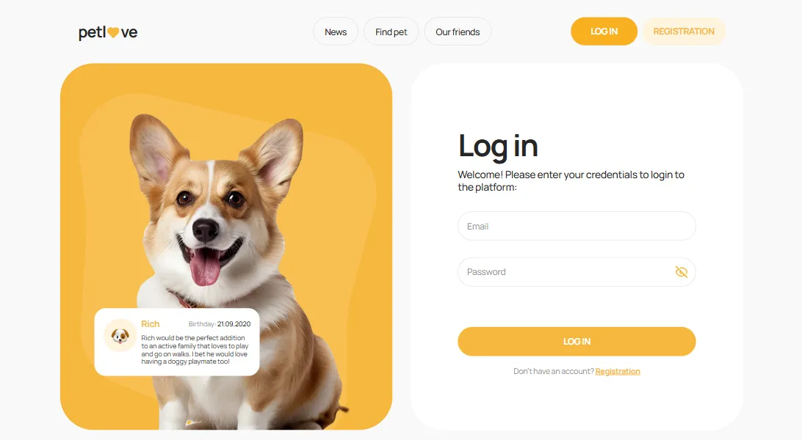

**Register page**

- Includes a registration form with validation. Fields include Name, Email,
  Password, and Confirm Password.
- On successful submission, the form is sent to the backend. If the backend
  returns an error, a notification is displayed.
- Upon successful registration, the user is automatically logged in and
  redirected to the Profile page.
- Includes a link to the Login page for existing users.

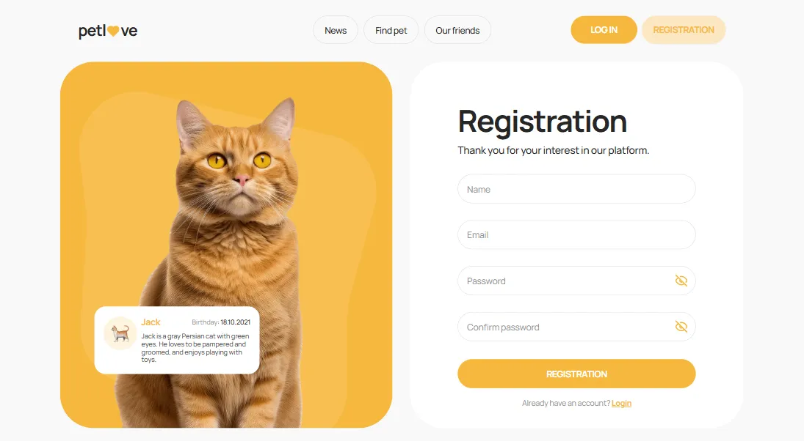

**2. Home**

- Displays the main title of the application along with a description.
- Features a static content image that represents the application.

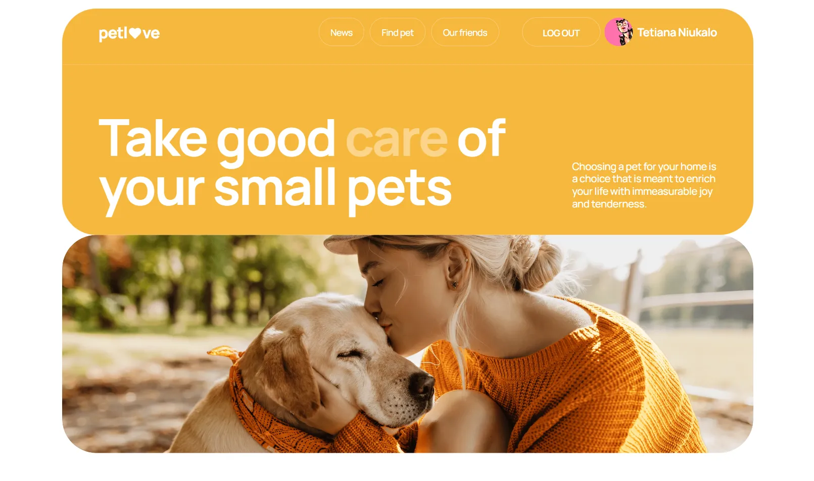

**3. News Page**

- Provides a keyword search with an input field and a clear button to reset the
  search.
- Shows news items, each featuring an image, title, summary, publication date,
  and a Read more link that opens the news source in a new browser tab.
- Pagination allows navigation through news pages and is hidden if there's only
  one page.

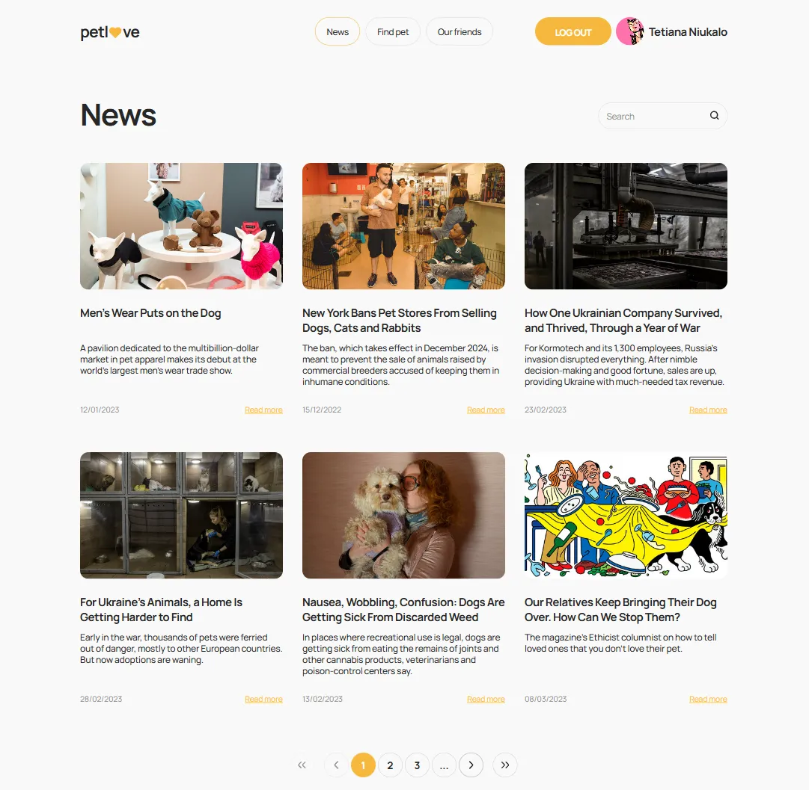

**4. Find pet page**

- Users can filter the content using options like keyword search, category,
  gender, pet type, and location. Additionally, there are radio buttons for
  sorting the notices by popularity or price. A "Reset all filters" button is
  available to clear all filters and reset the form to its default values.
- The list of notices consists of cards, each containing an image, price, title,
  popularity indicator, pet name, birth date, gender, type, category, comment,
  and two functional buttons:

         - For unauthenticated users, a modal appears prompting them to log in or register.
         - For authenticated users, a modal shows detailed information about the pet along with an Add to Favorites button.
         - When an authenticated user adds their first pet to favorites, a modal window appears with a congratulatory message and a button that redirects to the favorites page.

  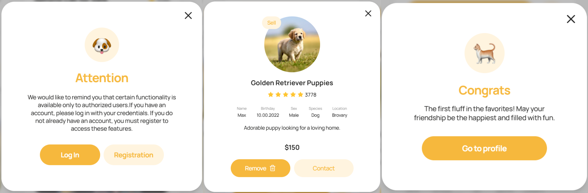

- The system also includes server-side pagination, allowing users to navigate
  between the first, last, previous, and next pages.

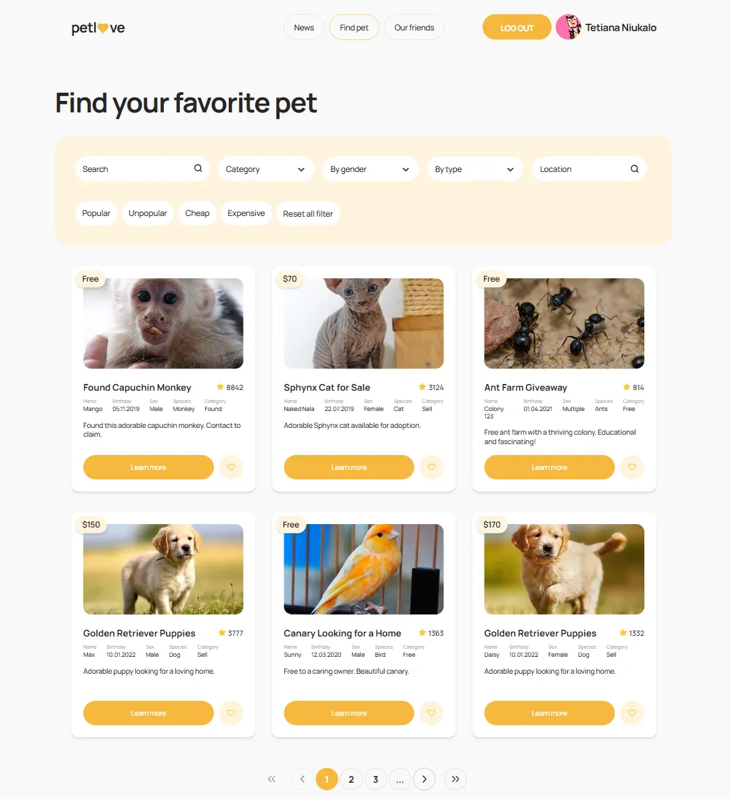

**5. Our friends page**

- The page displays a list of partners, each partner includes the company’s
  logo, name, contact details (address, email, phone), and working hours. The
  contact information is presented as clickable links.
- Clicking on the address link redirects the user to a map (opening in a new
  tab), while clicking on the company name redirects to the company's website.

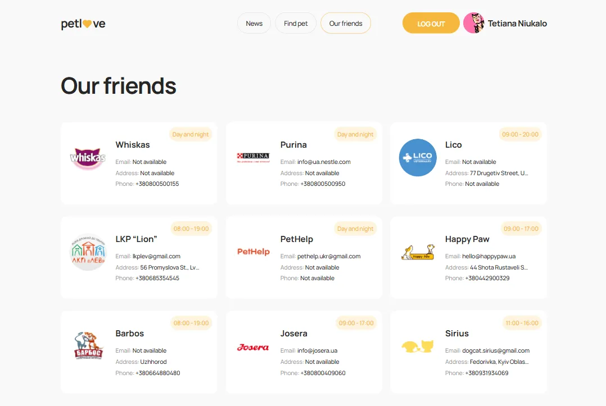

**6. Profile page**

**_The profile page consists of two main sections:_**

- _User card:_

          - Displays the user`s avatar (with the option to edit it), name, email, and phone number.
          - The edit user button triggers a modal where users can update their avatar, name, email, and phone number.
          - The PetsBlock shows a list of the user's pets with the option to add new ones through the "Add pet" button, which redirects to the "Add Pet" page.
          - The LogOutBtn triggers a confirmation modal to log out the user.

  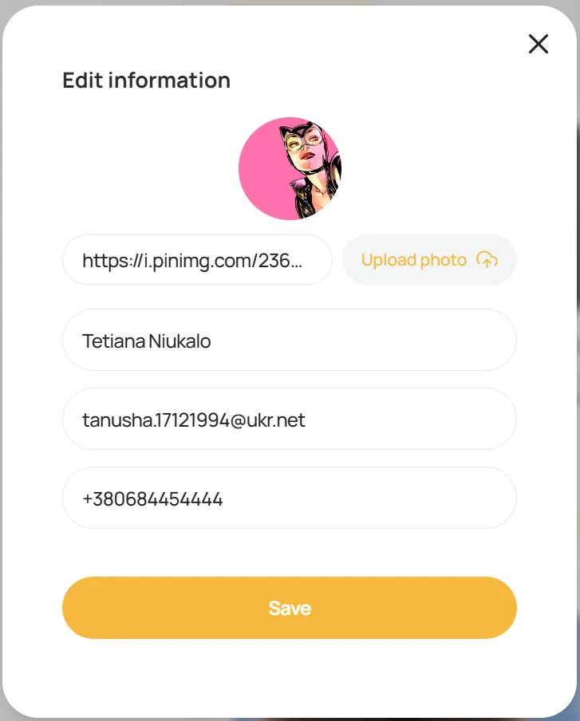

-_My notices:_

      -_Favorites:_This tab displays a list of notices that the user has added to their favorites. These are notices the user has specifically marked as important or interesting. Additionally, there is a trash icon that allows the user to remove a notice from their favorites list.

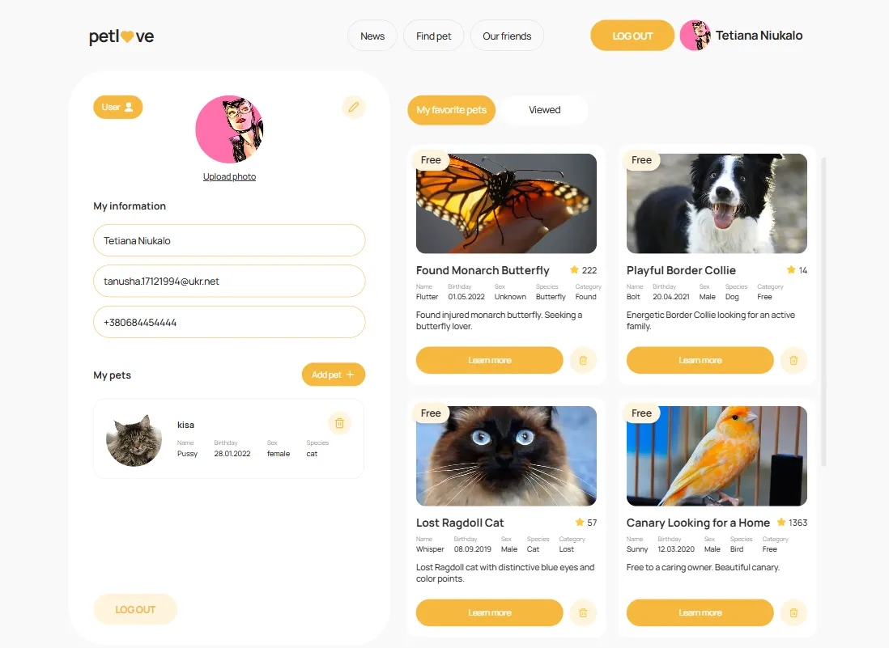

-_Vieved:_

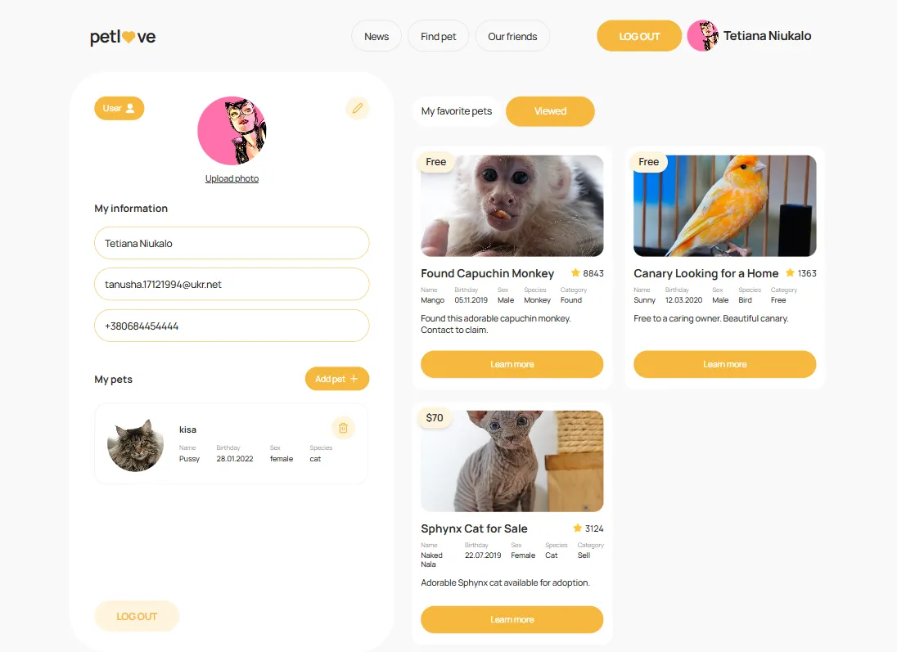

**7. Add Pet page**

Allows authenticated users to add a new pet to their profile with a simple form
interface.

- The form includes fields for title, name, image URL, species, birthday, and
  gender selection.
- If submitted successfully, the user is redirected to the Profile page, where
  the new pet appears. Clicking the "Back" button redirects to the Profile page
  without saving any data.

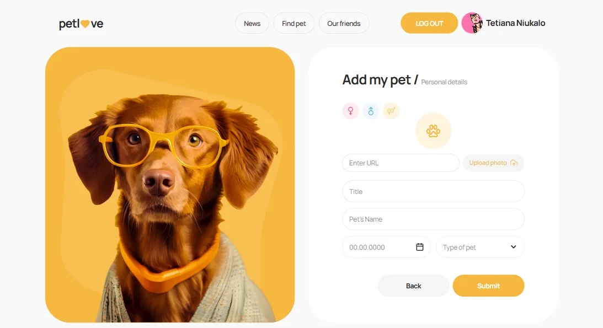

## Features

- **User Authentication**: Secure login, registration, and logout
  functionalities powered by Node.js.
- **Adaptive Design**: Fluid layout for breakpoints at 320px, 375px, 768px, and
  1440px. Ensures compatibility and usability across various devices.
- **Modal Dialogs**: Enhanced interaction through modal dialogs for login,
  registration and logaut.
- **Form Validation**: Implemented using React Hook Form and Yup for client-side
  validation.

## About the Project

[**Layout**](https://www.figma.com/file/puMNfZVg4YI8UZoJ1QiLLi/Petl%F0%9F%92%9Bve?type=design&node-id=55838-750&mode=design&t=Xg1IwIcKebTl5xGs-0)
|
[**Technical Task**](https://docs.google.com/spreadsheets/d/1DmQUeGZy_oaXN6yn69ORLzou1ZQRyTMlrAqPSit_clw/edit?gid=1134921873#gid=1134921873)
| [**API documentation**](https://petlove.b.goit.study/api-docs/)

## Technologies Used

## Deployment

This project is deployed on Vercel. Check it out:
[**PetLove**](https://pet-love-ecru.vercel.app/)
